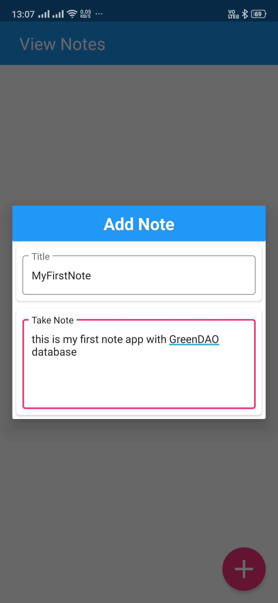

# GreenDAO : Android ORM
Saving data locally is basic requirement of every Android application. In Android, we can save data mainly in three ways.
  1. SharedPreferences
  2. SQLite
  3. File System
  
The simplest way to save data locally by using the SQLite database and working through `SqliteOpenHelper`. 

This approach requires writing raw queries and manipulation through `cursors`. 

It becomes difficult to manage when codebase becomes large and it is also possible to more manual errors.

#### So how do we solve our problems?

The solution is `Android ORM(Object-Relational Mapping)`.

#### What is ORM?

ORM is a programming technique for converting data between relational databases and object oriented programming languages. When we work with an object-oriented system, there is a mismatch between the object model and the relational database. RDBMSs represent data in a tabular format whereas object-oriented languages, such as Java or C# represent it as an interconnected graph of objects.

#### In Android there're many ORM
1. GreenDAO
2. OrmLite
3. Room Persistence Library
4. SugarORM
5. Realm
and many more...

# In this repository we learn about GreenDAO

### What is DAO and GreenDAO exactly :confused:? 

DAO is `Data Access Objects`.

greenDAO is an `open source` Android ORM making development for SQLite databases easy. It relieves developers from dealing with low-level database requirements while saving development time. greenDAO frees you from writing SQL and parsing query results, which are quite tedious and time-consuming tasks, by mapping `Java objects to database tables` called ORM. This way you can store, update, delete, and query for Java objects using a simple object-oriented API.


#### greenDAO 3 uses Annotation Processing to generate the DAO classes.

### So the question is how do we start  ?
### Here is step to USE greenDAO in Android.
- [ ] Add Gradle dependency in app/build.gradle.
- [ ] Add GreenDAO Gradle plugin for the Annotation processing in the root project build.gradle.
- [ ] Then use this plugin in the app/build.gradle, below com.android.application plugin
- [ ] GreenDAO requires us to create the schema of the table in the form of a class with greenDAO annotations.
- [ ] Explore the DAO generated classes at app/build/generated/source/greendao. We can see few classes in this folder.
- [ ] Create Custome Class for GreenDAO new DB Version modification handling.
- [ ] To use the database we need to construct the DaoSession Object in Application Class.
- [ ] Create one class for handling CRUD operation.
- [ ] Test the data manipulation in the activity.
- [ ] specify the GreenDAO schema version of the database in the app/build.gradle.


### So, Let's start the coding.
- [X] Add Gradle dependency in app/build.gradle.

```gradle
Open app/build.gradle and this lines.
ext{
    greenDao = '3.2.2'
}
dependencies {
    implementation "org.greenrobot:greendao:$greenDao"
}
```

- [X] Add GreenDAO Gradle plugin for the Annotation processing in the root project build.gradle.

```gradle
buildscript {
    repositories {
        jcenter()
        mavenCentral() // add repository
        
    }
    dependencies {
        classpath 'com.android.tools.build:gradle:3.4.2'
        classpath 'org.greenrobot:greendao-gradle-plugin:3.2.2'
    }
}
```

- [X] Then use this plugin in the app/build.gradle, below com.android.application plugin
```gradle
apply plugin: 'com.android.application'
apply plugin: 'org.greenrobot.greendao'
```

- [X] GreenDAO requires us to create the schema of the table in the form of a class with greenDAO annotations. 

##### This is basic JAVA POJO model but when we use GreenDAO annotations as abstract layer so the pojo work as database table.

```java
@Entity(nameInDb = "noteEntity")
public class NoteModel {

    @Id(autoincrement = true)
    @Property(nameInDb = "noteId")
    private Long id;

    @Property(nameInDb = "note")
    private String note;

    @Property(nameInDb = "createdAt")
    private Long createdAt;

    @Property(nameInDb = "lastUpdatedAt")
    private Long lastUpdatedAt;
    }
```


 ``` generate getter, setters, and constructors for this class.```
 
 #### 1. @Entity: It defines the table name in the database.
 #### 2 .@Id: It defines the primary key of the table & autoincrement parameter show that value is creating automatic and never use once its use.
 #### 3 .@Property: It defines the row name in the note table.
 #### 4 .@Generated: Marks that a field, constructor or method was generated by greenDAO All the code elements that are marked with this annotation can be changed/removed during next run of generation in respect of model changes.
 
 >Here is more [greenDAO annotation](http://greenrobot.org/files/greendao/javadoc/3.1/org/greenrobot/greendao/annotation/package-summary.html).

- [X] Explore the DAO generated classes at app/build/generated/source/greendao. We can see there're three classes created in this folder.
```
1.DaoMaster: This class defines the methods for database creation and manipulation.
2.DaoSession: This class provides the DAO classes for accessing the database tables.
3.NoteModelDao: This class wraps the Note table and defines the Queries for it.

First two classes is Unique but third classes is depend on your schema table or GreenDAO implemented POJO Model.
```

- [X] Create Custome Class for GreenDAO new DB Version modification handling

This Class we create because with a new app version, We want to modify the database schema or alter the table. For this purpose provide a custom OpenHelper to the DaoMaster, If we don't want to update database then we Can use GreenDAO created Class.
```java
public class MyDBOpenHelper extends DaoMaster.OpenHelper {

    public MyDBOpenHelper(Context context, String name) {
        super(context, name);
    }

    public MyDBOpenHelper(Context context, String name, SQLiteDatabase.CursorFactory factory) {
        super(context, name, factory);
    }

    @Override
    public void onUpgrade(Database db, int oldVersion, int newVersion) {
        super.onUpgrade(db, oldVersion, newVersion);
        Log.d("DEBUG", "DB_OLD_VERSION : " + oldVersion + ", DB_NEW_VERSION : " + newVersion);
        DaoMaster.dropAllTables(db,true);
        DaoMaster.createAllTables(db,true);
    }
}
```


- [X] To use the database we need to construct the DaoSession Object in Application Class.

Create A class MainApplication which extends android.app.Application and mention it in the AndroidManifest.xml
```java
public class MainApplication extends Application {
    private static DaoSession session;
    private static MainApplication instance;

    @Override
    public void onCreate() {
        super.onCreate();
        instance = this;
        session = new DaoMaster(new MyDBOpenHelper(this,"notes.db").getWritableDb()).newSession();
        Stetho.initializeWithDefaults(this);
    }

    public static synchronized MainApplication getInstance() {
        return instance;
    }

    public static synchronized DaoSession getSession() {
        return session;
    }

    @Override
    public void onTerminate() {
        super.onTerminate();
    }
}
```

In AndroidManifest.xml add android:name=".MainApplication":

```java
application
...
android:name=".MainApplication"
...
```

- [X] Create one class for handling CRUD operation.
NoteOperation class is created that hold the CRUD operation methods.
```java
public class NoteOperation {

    private static DaoSession daoSession = MainApplication.getSession();

    public static void insertNoteData(NoteModel noteModel) {
        daoSession.getNoteModelDao().insertInTx(noteModel);
    }
    public static void insertNoteDataList(List<NoteModel> noteModel) {
        daoSession.getNoteModelDao().insertInTx(noteModel);
    }
    public static List<NoteModel> getAllNotes() {
        return daoSession.getNoteModelDao().loadAll();
    }
    public static void updateNotes(NoteModel noteModel) {
        daoSession.getNoteModelDao().updateInTx(noteModel);
    }
    public static void updateNoteList(List<NoteModel> noteModel) {
        daoSession.getNoteModelDao().updateInTx(noteModel);
    }
    public static void deleteNote(NoteModel noteModel) {
        daoSession.getNoteModelDao().delete(noteModel);
    }
    public static void deleteNote(Long id) {
        daoSession.getNoteModelDao().deleteByKeyInTx(id);
    }
    public static void deleteAllNote() {
        daoSession.getNoteModelDao().deleteAll();
    }

}
```

- [X] Test the data manipulation in the ViewNoteActivity  . 
```java
public class ViewNoteActivity extends AppCompatActivity {
    Context context;
    List<NoteModel> noteModels = new ArrayList<>();
    HashMap<Long, NoteModel> noteModelHashMap = new HashMap<>();

    @Override
    protected void onCreate(Bundle savedInstanceState) {
        super.onCreate(savedInstanceState);
        setContentView(R.layout.activity_view_note);
        context = getApplicationContext();
        
    }

    @Override
    protected void onResume() {
        super.onResume();
        List<NoteModel> noteModelList = NoteOperation.getAllNotes();
        noteModels.clear();
        if (noteModelList != null && !noteModelList.isEmpty()) {
            noteModels.addAll(noteModelList);
        }
    }

```

- [X] specify the greendao schema version of the database in the app/build.gradle.
You will need to specify the schema version of the database so that you can distinguish the old version and new version when the entity schema is upgraded.Specify this add greendao schema in the app/build.gradle.
```gradle
android {
...
...
}

greendao{
    schemaVersion 1
}

dependencies {
...
...
}
```

When you upgrade the schema in the new app version, increase this schema Version. You should handle the upgrade code in onUpgrade method of the DbOpenHelper class.

## So here is your app ready :smiley:with greenDao database
<p >
  
  
  
  
  
</p>

# Download
<a href="https://github.com/deepakgupta7403/GreenDAODemo/blob/master/apk/app-debug.apk?raw=true">Click here to download!</a>

# Libraries Used
* [AndroidX Material Component](https://developer.android.com/reference/com/google/android/material/packages)
* [AndroidX CardView Libraries](https://developer.android.com/jetpack/androidx/releases/cardview)
* [AndroidX Support Libraries](https://developer.android.com/jetpack/androidx/releases/legacy)
* [AndroidX RecyclerView Libraries](https://developer.android.com/jetpack/androidx/releases/recyclerview)
* [Green Dao](http://greenrobot.org/greendao/)
* [Stetho](http://facebook.github.io/stetho/)
* [TextDrawable](https://github.com/amulyakhare/TextDrawable)
* [Markdown](https://guides.github.com/features/mastering-markdown/)

# LICENSE
```
MIT License

Copyright (c) 2019

Permission is hereby granted, free of charge, to any person obtaining a copy
of this software and associated documentation files (the "Software"), to deal
in the Software without restriction, including without limitation the rights
to use, copy, modify, merge, publish, distribute, sublicense, and/or sell
copies of the Software, and to permit persons to whom the Software is
furnished to do so, subject to the following conditions:

The above copyright notice and this permission notice shall be included in all
copies or substantial portions of the Software.

THE SOFTWARE IS PROVIDED "AS IS", WITHOUT WARRANTY OF ANY KIND, EXPRESS OR
IMPLIED, INCLUDING BUT NOT LIMITED TO THE WARRANTIES OF MERCHANTABILITY,
FITNESS FOR A PARTICULAR PURPOSE AND NONINFRINGEMENT. IN NO EVENT SHALL THE
AUTHORS OR COPYRIGHT HOLDERS BE LIABLE FOR ANY CLAIM, DAMAGES OR OTHER
LIABILITY, WHETHER IN AN ACTION OF CONTRACT, TORT OR OTHERWISE, ARISING FROM,
OUT OF OR IN CONNECTION WITH THE SOFTWARE OR THE USE OR OTHER DEALINGS IN THE
SOFTWARE.
```
